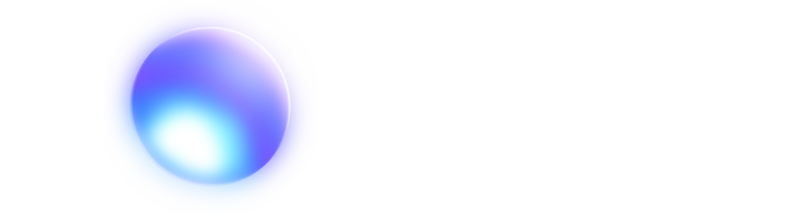

The **Quark Collection** is a library of single-file utilities built for use in Godot 4.

This project aims to create the simplest possible reusable modules for game development while also keeping the flexibility and power of more complex solutions.

## Usage

All utilities in the Quark Collection are stored as a single, self-contained, completely independent script each. Installing them is as easy as downloading the script you wish to use and adding it to your project's folder.

Alternatively, if a script has extra installation steps (i.e. if it's meant to be added as an autoload global), it will contain that information at the top of the file, alongside its description.

**WARNING:** Quark is not afraid of breaking compatibility between file versions. Check the [version number](https://semver.org/) on top of each file to know if it has API-breaking changes!

## Origin

While working with Godot, I found many addons contain a lot of unnecessary clutter, with an installation process that leaves a lot to be desired. Not only that, but they often do things in a way that is, in my opinion, over-engineered, which is terrible for game jams.

As such, taking heavy inspiration from [STB](https://github.com/nothings/stb), I created Quark as a way to have reusable code without relying on addons or unnecessary complexity.

## License

All files in this repository are under the MIT license. For more information, check [Choose a License](https://choosealicense.com/licenses/mit/).